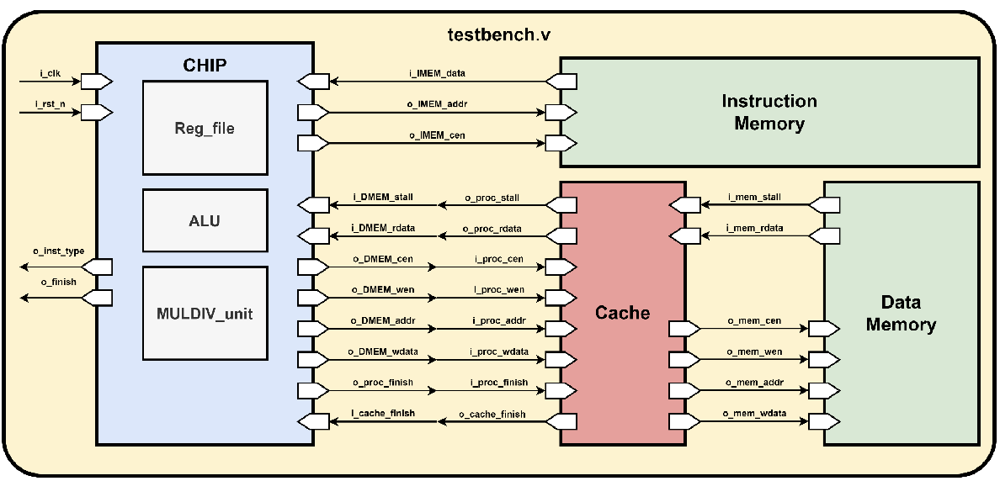
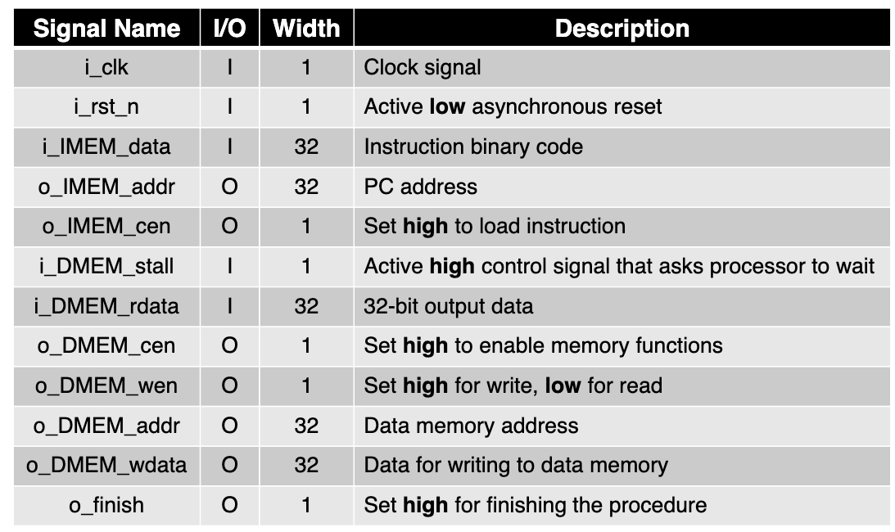

# CPU Implementation Project

This project involves the implementation of a custom CPU with specific features such as a multiplication/division unit, support for multi-cycle operations, and a caching mechanism.

---

## Features

### 1. **Add Multiplication/Division Unit (mulDiv)**
   - Introduced a specialized unit to handle multiplication and division operations.
   - Enables the CPU to perform arithmetic computations more efficiently.

### 2. **Handle Multi-Cycle Operations**
   - Supports operations that require multiple clock cycles to complete.
   - Improved timing and resource management for complex instructions.

### 3. **Implement Cache**
   - Added a caching mechanism to improve data access speed.
   - Reduces the latency for fetching instructions and data from main memory.

---

## System Architecture

The system architecture is depicted in the following diagram:



This diagram illustrates the integration of the multiplication/division unit, multi-cycle operation handling, and cache system within the CPU.



This table illustrates the input / output description of this system.

---

## How to Use

1. Clone this repository:
   ```bash
   git clone https://github.com/gary920209/CA_Finalproject
.git
